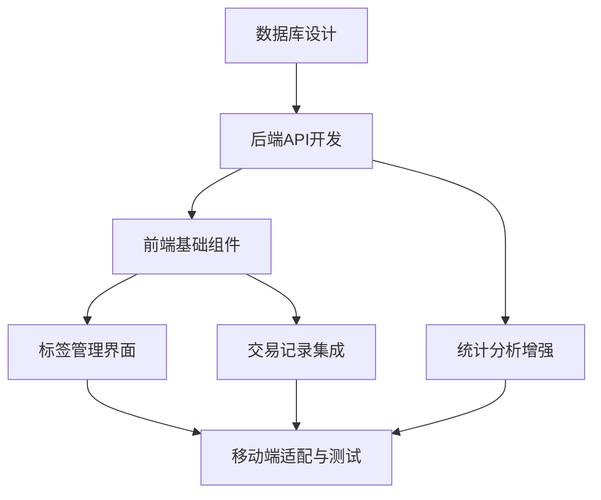

# 标签系统实施计划

## 概述

本文档详细描述了标签系统的实施计划，包括任务分解、优先级排序、时间估算和依赖关系。

## 总体时间规划

**预计总工期**: 9个工作日
**开发人员**: 1名全栈开发工程师
**测试时间**: 包含在各阶段中

## 阶段划分

### 阶段1: 数据库设计与迁移 (1天)
**目标**: 完成数据库表结构设计和迁移文件创建

#### 任务1.1: 数据库表结构设计 (2小时)
- **输入**: 技术架构文档
- **输出**: 完整的SQL表结构定义
- **具体任务**:
  - 设计tags表结构
  - 设计transaction_tags关联表结构
  - 定义字段类型、约束和索引
  - 设计触发器和函数

#### 任务1.2: 创建数据库迁移文件 (3小时)
- **输入**: 表结构设计
- **输出**: 1.4.0-to-1.5.0.sql迁移文件
- **具体任务**:
  - 编写CREATE TABLE语句
  - 添加约束和索引
  - 创建触发器和函数
  - 遵循迁移规范格式

#### 任务1.3: 迁移测试和验证 (3小时)
- **输入**: 迁移文件
- **输出**: 验证通过的迁移文件
- **具体任务**:
  - 在测试环境执行迁移
  - 验证表结构正确性
  - 测试约束和触发器
  - 性能测试和优化

### 阶段2: 后端API开发 (2天)

#### 任务2.1: 数据模型和类型定义 (2小时)
- **输入**: 数据库设计
- **输出**: TypeScript类型定义和Prisma模型
- **具体任务**:
  - 更新Prisma schema
  - 定义TypeScript接口
  - 创建DTO类型定义
  - 生成Prisma客户端

#### 任务2.2: 标签管理API开发 (6小时)
- **输入**: API设计文档
- **输出**: 完整的标签CRUD API
- **具体任务**:
  - 实现GET /api/tags（列表查询）
  - 实现POST /api/tags（创建标签）
  - 实现PUT /api/tags/{id}（更新标签）
  - 实现DELETE /api/tags/{id}（删除标签）
  - 实现GET /api/tags/{id}（标签详情）
  - 添加权限验证中间件
  - 添加数据验证和错误处理

#### 任务2.3: 交易标签关联API开发 (6小时)
- **输入**: API设计文档
- **输出**: 交易标签关联API
- **具体任务**:
  - 实现GET /api/transactions/{id}/tags
  - 实现POST /api/transactions/{id}/tags
  - 实现DELETE /api/transactions/{id}/tags/{tagId}
  - 实现POST /api/transactions/batch/tags
  - 添加批量操作逻辑
  - 优化查询性能

#### 任务2.4: 统计分析API开发 (2小时)
- **输入**: API设计文档
- **输出**: 标签统计API
- **具体任务**:
  - 实现GET /api/statistics/by-tags
  - 实现GET /api/statistics/tag-trends
  - 优化复杂查询性能
  - 添加缓存机制

### 阶段3: 前端基础组件开发 (2天)

#### 任务3.1: 标签显示组件 (3小时)
- **输入**: UI设计文档
- **输出**: TagDisplay组件
- **具体任务**:
  - 创建TagDisplay组件
  - 实现不同尺寸支持
  - 添加点击和移除功能
  - 适配主题系统
  - 添加动画效果

#### 任务3.2: 颜色选择器组件 (3小时)
- **输入**: UI设计文档
- **输出**: ColorPicker组件
- **具体任务**:
  - 创建ColorPicker组件
  - 实现预设颜色选择
  - 添加自定义颜色功能
  - 实时预览效果
  - 移动端适配

#### 任务3.3: 标签选择器组件 (6小时)
- **输入**: UI设计文档
- **输出**: TagSelector组件
- **具体任务**:
  - 创建TagSelector组件
  - 实现多选功能
  - 添加搜索功能
  - 实现快速创建标签
  - 移动端底部弹出适配
  - 添加键盘导航支持

#### 任务3.4: API客户端集成 (4小时)
- **输入**: 后端API
- **输出**: 前端API客户端
- **具体任务**:
  - 创建标签API客户端函数
  - 添加错误处理
  - 实现数据缓存
  - 添加加载状态管理

### 阶段4: 标签管理界面开发 (1天)

#### 任务4.1: 标签管理页面 (4小时)
- **输入**: UI设计文档和基础组件
- **输出**: 完整的标签管理页面
- **具体任务**:
  - 创建/settings/tags页面
  - 实现标签列表展示
  - 添加搜索和筛选功能
  - 集成CRUD操作
  - 添加分页功能

#### 任务4.2: 标签编辑模态框 (3小时)
- **输入**: 基础组件
- **输出**: TagEditModal组件
- **具体任务**:
  - 创建标签编辑模态框
  - 集成颜色选择器
  - 添加表单验证
  - 实现创建和编辑功能
  - 添加删除确认对话框

#### 任务4.3: 权限控制和错误处理 (1小时)
- **输入**: 权限设计文档
- **输出**: 完善的权限控制
- **具体任务**:
  - 实现权限检查逻辑
  - 添加错误提示
  - 优化用户体验

### 阶段5: 交易记录集成 (1天)

#### 任务5.1: 交易详情页面集成 (3小时)
- **输入**: 现有交易详情页面
- **输出**: 集成标签功能的交易详情页面
- **具体任务**:
  - 在交易详情页面添加标签显示
  - 添加标签编辑功能
  - 集成TagSelector组件
  - 更新页面布局

#### 任务5.2: 交易列表页面集成 (3小时)
- **输入**: 现有交易列表页面
- **输出**: 显示标签的交易列表
- **具体任务**:
  - 在交易列表项中显示标签
  - 优化列表性能
  - 添加标签筛选功能
  - 适配移动端布局

#### 任务5.3: 批量操作功能 (2小时)
- **输入**: 现有批量操作功能
- **输出**: 支持标签的批量操作
- **具体任务**:
  - 添加批量添加标签功能
  - 添加批量移除标签功能
  - 优化操作反馈
  - 添加进度显示

### 阶段6: 统计分析功能增强 (1天)

#### 任务6.1: 标签筛选器 (3小时)
- **输入**: 现有统计分析页面
- **输出**: 支持标签筛选的统计页面
- **具体任务**:
  - 在统计页面添加标签筛选器
  - 集成TagSelector组件
  - 更新筛选逻辑
  - 优化查询性能

#### 任务6.2: 按标签分析页面 (4小时)
- **输入**: 统计API和UI设计
- **输出**: 完整的标签分析页面
- **具体任务**:
  - 创建按标签分析页面
  - 实现标签统计图表
  - 添加标签组合分析
  - 优化数据可视化

#### 任务6.3: 图表交互增强 (1小时)
- **输入**: 现有图表组件
- **输出**: 支持标签交互的图表
- **具体任务**:
  - 添加图例点击功能
  - 实现标签筛选联动
  - 优化交互体验

### 阶段7: 移动端适配与测试 (1天)

#### 任务7.1: 移动端UI优化 (3小时)
- **输入**: 所有前端组件
- **输出**: 移动端优化的标签功能
- **具体任务**:
  - 优化标签选择器移动端体验
  - 调整按钮和间距
  - 测试触摸交互
  - 优化性能

#### 任务7.2: 全面功能测试 (3小时)
- **输入**: 完整的标签系统
- **输出**: 测试报告和修复
- **具体任务**:
  - 功能测试（所有API和UI）
  - 兼容性测试（不同浏览器和设备）
  - 性能测试（大量数据场景）
  - 用户体验测试

#### 任务7.3: 文档和部署准备 (2小时)
- **输入**: 完成的功能
- **输出**: 部署就绪的系统
- **具体任务**:
  - 更新用户文档
  - 准备发布说明
  - 验证生产环境兼容性
  - 准备回滚方案

## 依赖关系

## 风险评估

### 高风险项
1. **数据库迁移**: 可能影响现有数据
   - **缓解措施**: 充分测试，备份数据
2. **性能影响**: 大量标签可能影响查询性能
   - **缓解措施**: 索引优化，分页加载

### 中风险项
1. **UI兼容性**: 新组件可能与现有样式冲突
   - **缓解措施**: 遵循现有设计规范
2. **移动端体验**: 复杂交互在移动端可能不够友好
   - **缓解措施**: 专门的移动端适配

### 低风险项
1. **API兼容性**: 新API不影响现有功能
2. **用户学习成本**: 标签功能相对简单易懂

## 质量保证

### 代码质量
- 遵循现有代码规范
- 添加适当的注释
- 实现单元测试覆盖

### 测试策略
- 单元测试：核心业务逻辑
- 集成测试：API接口
- E2E测试：关键用户流程
- 性能测试：大数据量场景

### 文档要求
- API文档更新
- 组件使用文档
- 用户操作指南
- 故障排除指南

## 发布计划

### 内测版本 (Alpha)
- 完成核心功能开发
- 内部团队测试
- 收集初步反馈

### 公测版本 (Beta)
- 修复已知问题
- 邀请用户测试
- 性能优化

### 正式版本 (Release)
- 完成所有功能
- 通过全面测试
- 准备生产部署

---

**文档版本**: v1.0
**创建时间**: 2024年
**项目团队**: zhiweijz-team
