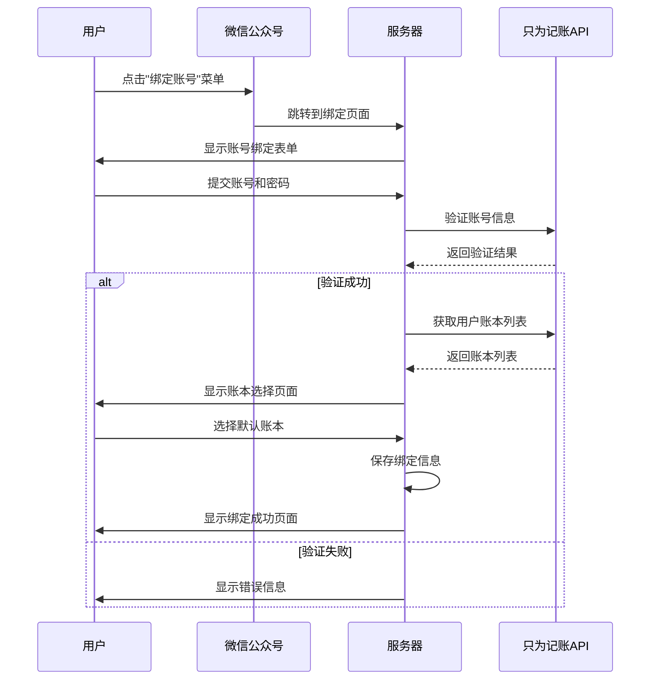

# 微信公众号账号绑定功能实现指南

本文档详细说明如何实现微信公众号与只为记账账号的绑定功能，包括绑定流程、页面设计和后端实现。

## 绑定流程设计

### 整体流程

1. 用户点击公众号菜单中的"绑定账号"
2. 跳转到绑定页面，用户输入只为记账账号和密码
3. 系统验证账号信息，成功后获取用户账本列表
4. 用户选择默认账本
5. 系统保存绑定信息，返回绑定成功提示

### 流程图



## 前端页面实现

### 1. 绑定账号页面

```html
<!DOCTYPE html>
<html>
<head>
    <meta charset="UTF-8">
    <meta name="viewport" content="width=device-width, initial-scale=1.0">
    <title>绑定只为记账账号</title>
    <link rel="stylesheet" href="/css/wechat.css">
</head>
<body>
    <div class="container">
        <h1>绑定只为记账账号</h1>
        <form id="bindForm" action="/wechat/bind" method="post">
            <div class="form-group">
                <label for="username">账号</label>
                <input type="text" id="username" name="username" required>
            </div>
            <div class="form-group">
                <label for="password">密码</label>
                <input type="password" id="password" name="password" required>
            </div>
            <div class="form-group">
                <button type="submit" class="btn-primary">验证账号</button>
            </div>
        </form>
        <div class="tips">
            <p>提示：绑定账号后，您可以直接在公众号中进行记账操作</p>
        </div>
    </div>
    <script src="/js/bind.js"></script>
</body>
</html>
```

### 2. 账本选择页面

```html
<!DOCTYPE html>
<html>
<head>
    <meta charset="UTF-8">
    <meta name="viewport" content="width=device-width, initial-scale=1.0">
    <title>选择默认账本</title>
    <link rel="stylesheet" href="/css/wechat.css">
</head>
<body>
    <div class="container">
        <h1>选择默认账本</h1>
        <form id="bookForm" action="/wechat/select-book" method="post">
            <div class="form-group">
                <label for="bookId">选择账本</label>
                <select id="bookId" name="bookId" required>
                    <!-- 账本列表将通过JavaScript动态填充 -->
                </select>
            </div>
            <div class="form-group">
                <button type="submit" class="btn-primary">确认选择</button>
            </div>
        </form>
    </div>
    <script src="/js/select-book.js"></script>
</body>
</html>
```

### 3. 绑定成功页面

```html
<!DOCTYPE html>
<html>
<head>
    <meta charset="UTF-8">
    <meta name="viewport" content="width=device-width, initial-scale=1.0">
    <title>绑定成功</title>
    <link rel="stylesheet" href="/css/wechat.css">
</head>
<body>
    <div class="container success-container">
        <div class="success-icon">✓</div>
        <h1>绑定成功</h1>
        <p>您的只为记账账号已成功绑定</p>
        <p>默认账本：<span id="bookName"></span></p>
        <div class="tips">
            <p>现在您可以：</p>
            <ul>
                <li>直接发送消息进行记账</li>
                <li>查询账本余额</li>
                <li>使用更多记账功能</li>
            </ul>
        </div>
        <div class="btn-container">
            <a href="javascript:WeixinJSBridge.call('closeWindow');" class="btn-secondary">关闭页面</a>
        </div>
    </div>
    <script src="/js/success.js"></script>
</body>
</html>
```

## 后端实现

### 1. 路由设置

```javascript
const express = require('express');
const router = express.Router();
const bindingController = require('../controllers/bindingController');
const wechatAuth = require('../middlewares/wechatAuth');

// 绑定页面路由
router.get('/bind', wechatAuth, bindingController.showBindPage);
router.post('/bind', wechatAuth, bindingController.verifyAccount);

// 账本选择路由
router.get('/select-book', wechatAuth, bindingController.showBookSelectPage);
router.post('/select-book', wechatAuth, bindingController.saveSelectedBook);

// 解除绑定路由
router.get('/unbind', wechatAuth, bindingController.showUnbindPage);
router.post('/unbind', wechatAuth, bindingController.unbindAccount);

module.exports = router;
```

### 2. 控制器实现

```javascript
const zhiweiService = require('../services/zhiweiService');
const bindingService = require('../services/bindingService');

// 绑定控制器
const bindingController = {
  // 显示绑定页面
  showBindPage: (req, res) => {
    const openid = req.session.openid;
    res.render('bind', { openid });
  },
  
  // 验证账号
  verifyAccount: async (req, res) => {
    try {
      const { username, password } = req.body;
      const openid = req.session.openid;
      
      // 调用只为记账API验证账号
      const authResult = await zhiweiService.authenticate(username, password);
      
      if (authResult.success) {
        // 保存用户凭证到会话
        req.session.zhiweiToken = authResult.token;
        req.session.zhiweiUserId = authResult.userId;
        
        // 获取用户账本列表
        const books = await zhiweiService.getUserBooks(authResult.token);
        
        // 保存账号信息
        await bindingService.saveAccountBinding(openid, username, authResult.userId, authResult.token);
        
        // 将账本列表保存到会话
        req.session.books = books;
        
        // 重定向到账本选择页面
        res.redirect('/wechat/select-book');
      } else {
        // 验证失败，返回错误信息
        res.render('bind', { 
          openid, 
          error: '账号或密码错误，请重试' 
        });
      }
    } catch (error) {
      console.error('账号验证失败:', error);
      res.render('bind', { 
        openid: req.session.openid, 
        error: '系统错误，请稍后重试' 
      });
    }
  },
  
  // 显示账本选择页面
  showBookSelectPage: (req, res) => {
    const { books } = req.session;
    
    if (!books || books.length === 0) {
      return res.redirect('/wechat/bind');
    }
    
    res.render('select-book', { books });
  },
  
  // 保存选择的账本
  saveSelectedBook: async (req, res) => {
    try {
      const { bookId } = req.body;
      const openid = req.session.openid;
      const books = req.session.books;
      
      // 查找选择的账本信息
      const selectedBook = books.find(book => book.id === bookId);
      
      if (!selectedBook) {
        return res.render('select-book', { 
          books, 
          error: '无效的账本选择' 
        });
      }
      
      // 保存默认账本
      await bindingService.saveDefaultBook(openid, bookId);
      
      // 渲染成功页面
      res.render('success', { 
        bookName: selectedBook.name 
      });
    } catch (error) {
      console.error('保存账本失败:', error);
      res.render('select-book', { 
        books: req.session.books, 
        error: '系统错误，请稍后重试' 
      });
    }
  },
  
  // 显示解除绑定页面
  showUnbindPage: async (req, res) => {
    const openid = req.session.openid;
    
    // 获取当前绑定信息
    const binding = await bindingService.getBinding(openid);
    
    if (!binding) {
      return res.render('unbind', { 
        error: '您尚未绑定账号' 
      });
    }
    
    res.render('unbind', { binding });
  },
  
  // 解除绑定
  unbindAccount: async (req, res) => {
    try {
      const openid = req.session.openid;
      
      // 删除绑定信息
      await bindingService.removeBinding(openid);
      
      // 清除会话信息
      delete req.session.zhiweiToken;
      delete req.session.zhiweiUserId;
      delete req.session.books;
      
      res.render('unbind-success');
    } catch (error) {
      console.error('解除绑定失败:', error);
      res.render('unbind', { 
        error: '系统错误，请稍后重试' 
      });
    }
  }
};

module.exports = bindingController;
```

### 3. 服务层实现

```javascript
// 只为记账API服务
const axios = require('axios');

const zhiweiService = {
  // 验证账号
  authenticate: async (username, password) => {
    try {
      const response = await axios.post(`${process.env.ZHIWEI_API_BASE_URL}/auth/login`, {
        username,
        password
      }, {
        headers: {
          'Content-Type': 'application/json',
          'X-API-Key': process.env.ZHIWEI_API_KEY
        }
      });
      
      return {
        success: true,
        token: response.data.token,
        userId: response.data.userId
      };
    } catch (error) {
      console.error('认证失败:', error.response?.data || error.message);
      return {
        success: false,
        error: error.response?.data?.message || '认证失败'
      };
    }
  },
  
  // 获取用户账本列表
  getUserBooks: async (token) => {
    try {
      const response = await axios.get(`${process.env.ZHIWEI_API_BASE_URL}/books`, {
        headers: {
          'Authorization': `Bearer ${token}`,
          'X-API-Key': process.env.ZHIWEI_API_KEY
        }
      });
      
      return response.data.books || [];
    } catch (error) {
      console.error('获取账本失败:', error.response?.data || error.message);
      throw new Error('获取账本失败');
    }
  }
};

// 绑定服务
const db = require('../models/db');

const bindingService = {
  // 保存账号绑定信息
  saveAccountBinding: async (openid, username, userId, token) => {
    try {
      // 检查是否已存在绑定
      const existingBinding = await db.query(
        'SELECT * FROM user_bindings WHERE openid = $1',
        [openid]
      );
      
      if (existingBinding.rows.length > 0) {
        // 更新现有绑定
        await db.query(
          'UPDATE user_bindings SET zhiwei_account = $1, zhiwei_user_id = $2, zhiwei_token = $3, updated_at = NOW() WHERE openid = $4',
          [username, userId, token, openid]
        );
      } else {
        // 创建新绑定
        await db.query(
          'INSERT INTO user_bindings (openid, zhiwei_account, zhiwei_user_id, zhiwei_token) VALUES ($1, $2, $3, $4)',
          [openid, username, userId, token]
        );
      }
      
      return true;
    } catch (error) {
      console.error('保存绑定信息失败:', error);
      throw error;
    }
  },
  
  // 保存默认账本
  saveDefaultBook: async (openid, bookId) => {
    try {
      await db.query(
        'UPDATE user_bindings SET default_book_id = $1, updated_at = NOW() WHERE openid = $2',
        [bookId, openid]
      );
      
      return true;
    } catch (error) {
      console.error('保存默认账本失败:', error);
      throw error;
    }
  },
  
  // 获取绑定信息
  getBinding: async (openid) => {
    try {
      const result = await db.query(
        'SELECT * FROM user_bindings WHERE openid = $1',
        [openid]
      );
      
      return result.rows[0] || null;
    } catch (error) {
      console.error('获取绑定信息失败:', error