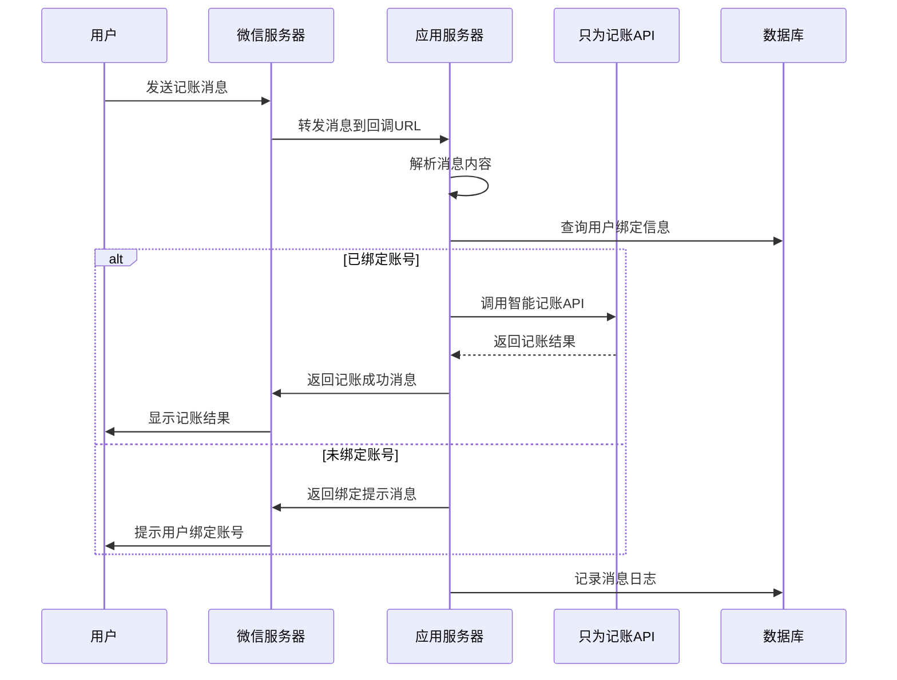

# 微信公众号消息处理实现指南

本文档详细说明如何处理微信公众号用户发送的消息，并调用只为记账的智能记账接口实现自动记账功能。

## 消息处理流程

### 整体流程

1. 用户向公众号发送记账相关消息
2. 微信服务器将消息转发到配置的回调URL
3. 服务器接收消息并进行解析
4. 判断用户是否已绑定只为记账账号
5. 调用只为记账智能记账API
6. 将记账结果返回给用户

### 流程图



## 消息接收与解析

### 1. 配置消息接收路由

```javascript
const express = require('express');
const router = express.Router();
const wechatController = require('../controllers/wechatController');
const wechatMiddleware = require('../middlewares/wechatMiddleware');

// 微信消息接收路由
router.post('/callback', wechatMiddleware.verifySignature, express.text({ type: 'text/xml' }), wechatController.handleMessage);

module.exports = router;
```

### 2. 微信签名验证中间件

```javascript
const crypto = require('crypto');

const wechatMiddleware = {
  // 验证微信请求签名
  verifySignature: (req, res, next) => {
    const { signature, timestamp, nonce, echostr } = req.query;
    const token = process.env.WECHAT_TOKEN;
    
    // 如果是GET请求，说明是配置验证
    if (req.method === 'GET') {
      if (checkSignature(signature, timestamp, nonce, token)) {
        return res.send(echostr);
      } else {
        return res.status(401).send('Invalid signature');
      }
    }
    
    // POST请求，验证签名后继续处理
    if (!checkSignature(signature, timestamp, nonce, token)) {
      return res.status(401).send('Invalid signature');
    }
    
    next();
  }
};

// 检查签名
function checkSignature(signature, timestamp, nonce, token) {
  const arr = [token, timestamp, nonce].sort();
  const str = arr.join('');
  const sha1 = crypto.createHash('sha1');
  sha1.update(str);
  const generatedSignature = sha1.digest('hex');
  
  return generatedSignature === signature;
}

module.exports = wechatMiddleware;
```

### 3. 消息解析与处理控制器

```javascript
const xml2js = require('xml2js');
const { parseStringPromise } = xml2js;
const messageService = require('../services/messageService');
const bindingService = require('../services/bindingService');
const zhiweiService = require('../services/zhiweiService');
const wechatReplyBuilder = require('../utils/wechatReplyBuilder');

const wechatController = {
  // 处理微信消息
  handleMessage: async (req, res) => {
    try {
      // 解析XML消息
      const result = await parseStringPromise(req.body, { explicitArray: false });
      const message = result.xml;
      
      // 记录接收到的消息
      await messageService.logMessage(message.FromUserName, 'received', message.Content || message.MsgType);
      
      // 根据消息类型处理
      switch (message.MsgType) {
        case 'text':
          return await handleTextMessage(message, res);
        case 'event':
          return await handleEventMessage(message, res);
        default:
          return res.send(wechatReplyBuilder.buildTextReply(
            message, 
            '暂不支持此类型消息，请发送文本消息进行记账'
          ));
      }
    } catch (error) {
      console.error('处理微信消息失败:', error);
      res.status(500).send('Internal Server Error');
    }
  }
};

// 处理文本消息
async function handleTextMessage(message, res) {
  const openid = message.FromUserName;
  const content = message.Content.trim();
  
  // 检查用户是否已绑定账号
  const binding = await bindingService.getBinding(openid);
  
  if (!binding) {
    // 用户未绑定账号，返回绑定提示
    return res.send(wechatReplyBuilder.buildTextReply(
      message,
      '您尚未绑定只为记账账号，请点击菜单"账号管理 > 绑定账号"进行绑定'
    ));
  }
  
  // 调用智能记账API
  try {
    const accountingResult = await zhiweiService.smartAccounting(
      binding.zhiwei_token,
      content,
      binding.default_book_id
    );
    
    // 记录记账结果
    await messageService.logMessage(openid, 'accounting_result', JSON.stringify(accountingResult));
    
    // 构建记账结果回复
    const replyContent = formatAccountingResult(accountingResult);
    return res.send(wechatReplyBuilder.buildTextReply(message, replyContent));
  } catch (error) {
    console.error('智能记账失败:', error);
    
    // 记录错误
    await messageService.logMessage(openid, 'accounting_error', error.message);
    
    // 返回错误信息
    return res.send(wechatReplyBuilder.buildTextReply(
      message,
      '记账失败，请稍后重试或检查记账格式是否正确'
    ));
  }
}

// 处理事件消息
async function handleEventMessage(message, res) {
  const openid = message.FromUserName;
  const event = message.Event.toLowerCase();
  
  switch (event) {
    case 'subscribe':
      // 用户关注公众号
      return res.send(wechatReplyBuilder.buildTextReply(
        message,
        '感谢关注！本公众号可以帮助您快速记账，请先点击菜单"账号管理 > 绑定账号"绑定您的只为记账账号。'
      ));
    
    case 'click':
      // 处理菜单点击事件
      return handleMenuClick(message, res);
    
    default:
      return res.send(wechatReplyBuilder.buildTextReply(
        message,
        '收到您的操作，但暂不支持此类型事件'
      ));
  }
}

// 处理菜单点击事件
async function handleMenuClick(message, res) {
  const openid = message.FromUserName;
  const key = message.EventKey;
  
  switch (key) {
    case 'USAGE_GUIDE':
      return res.send(wechatReplyBuilder.buildTextReply(
        message,
        '【使用说明】\n\n' +
        '1. 记账格式：[金额] [类别] [备注(可选)]\n' +
        '例如："50 餐饮 午餐"\n\n' +
        '2. 支持的记账类型：\n' +
        '- 支出：直接输入金额\n' +
        '- 收入：金额前加"收入"\n' +
        '例如："收入 5000 工资"\n\n' +
        '3. 更多功能请点击菜单栏了解'
      ));
    
    case 'ACCOUNTING_TEMPLATE':
      return res.send(wechatReplyBuilder.buildTextReply(
        message,
        '【记账模板】\n\n' +
        '1. 基本支出：\n' +
        '10 餐饮 早餐\n' +
        '25.5 交通 打车\n\n' +
        '2. 收入记录：\n' +
        '收入 5000 工资\n' +
        '收入 100 红包\n\n' +
        '3. 转账记录：\n' +
        '转账 1000 从招行到支付宝\n\n' +
        '复制以上模板修改金额和说明即可快速记账'
      ));
    
    case 'CHECK_BALANCE':
      return await handleBalanceCheck(message, res);
    
    case 'CUSTOMER_SERVICE':
      return res.send(wechatReplyBuilder.buildTextReply(
        message,
        '【联系客服】\n\n' +
        '客服邮箱：support@zhiwei.com\n' +
        '客服电话：400-888-8888\n' +
        '服务时间：周一至周五 9:00-18:00'
      ));
    
    case 'ABOUT_US':
      return res.send(wechatReplyBuilder.buildTextReply(
        message,
        '【关于我们】\n\n' +
        '只为记账是一款专注于个人和家庭财务管理的应用，致力于提供简单高效的记账体验。\n\n' +
        '官方网站：https://www.zhiwei.com\n' +
        '微博：@只为记账\n'
      ));
    
    default:
      return res.send(wechatReplyBuilder.buildTextReply(
        message,
        '收到您的操作，但暂不支持此功能'
      ));
  }
}

// 处理余额查询
async function handleBalanceCheck(message, res) {
  const openid = message.FromUserName;
  
  // 检查用户是否已绑定账号
  const binding = await bindingService.getBinding(openid);
  
  if (!binding) {
    return res.send(wechatReplyBuilder.buildTextReply(
      message,
      '您尚未绑定只为记账账号，请点击菜单"账号管理 > 绑定账号"进行绑定'
    ));
  }
  
  try {
    // 获取账本余额
    const balanceInfo = await zhiweiService.getBookBalance(
      binding.zhiwei_token,
      binding.default_book_id
    );
    
    // 构建余额信息回复
    const replyContent = formatBalanceInfo(balanceInfo);
    return res.send(wechatReplyBuilder.buildTextReply(message, replyContent));
  } catch (error) {
    console.error('获取余额失败:', error);
    return res.send(wechatReplyBuilder.buildTextReply(
      message,
      '获取余额失败，请稍后重试'
    ));
  }
}

// 格式化记账结果
function formatAccountingResult(result) {
  if (!result.success) {
    return `记账失败：${result.message || '未知错误'}`;
  }
  
  const record = result.record;
  let replyContent = '【记账成功】\n\n';
  
  if (record.type === 'expense') {
    replyContent += `支出：${record.amount} 元\n`;
  } else if (record.type === 'income') {
    replyContent += `收入：${record.amount} 元\n`;
  } else if (record.type === 'transfer') {
    replyContent += `转账：${record.amount} 元\n`;
  }
  
  replyContent += `分类：${record.category}\n`;
  
  if (record.description) {
    replyContent += `备注：${record.description}\n`;
  }
  
  replyContent += `时间：${formatDate(record.date)}\n`;
  replyContent += `账本：${record.bookName}\n\n`;
  
  // 添加账本余额信息
  if (result.balance) {
    replyContent += `当前账本余额：${result.balance} 元`;
  }
  
  return replyContent;
}

// 格式化余额信息
function formatBalanceInfo(balanceInfo) {
  let replyContent = '【账本余额】\n\n';
  replyContent += `账本名称：${balanceInfo.bookName}\n`;
  replyContent += `总资产：${balanceInfo.totalAssets} 元\n`;
  replyContent += `总负债：${balanceInfo.totalLiabilities} 元\n`;
  replyContent += `净资产：${balanceInfo.netAssets} 元\n\n`;
  
  // 添加本月收支信息
  replyContent += `本月收入：${balanceInfo.monthlyIncome} 元\n`;
  replyContent += `本月支出：${balanceInfo.monthlyExpense} 元\n`;
  replyContent += `本月结余：${balanceInfo.monthlySurplus} 元\n\n`;
  
  replyContent += `统计时间：${formatDate(new Date())}`;
  
  return replyContent;
}

// 格式化日期
function formatDate(date) {
  const d = new Date(date);
  return `${d.getFullYear()}-${padZero(d.getMonth() + 1)}-${padZero(d.getDate())} ${padZero(d.getHours())}:${padZero(d.getMinutes())}`;
}

// 补零
function padZero(num) {
  return num < 10 ? `0${num}` : num;
}

module.exports = wechatController